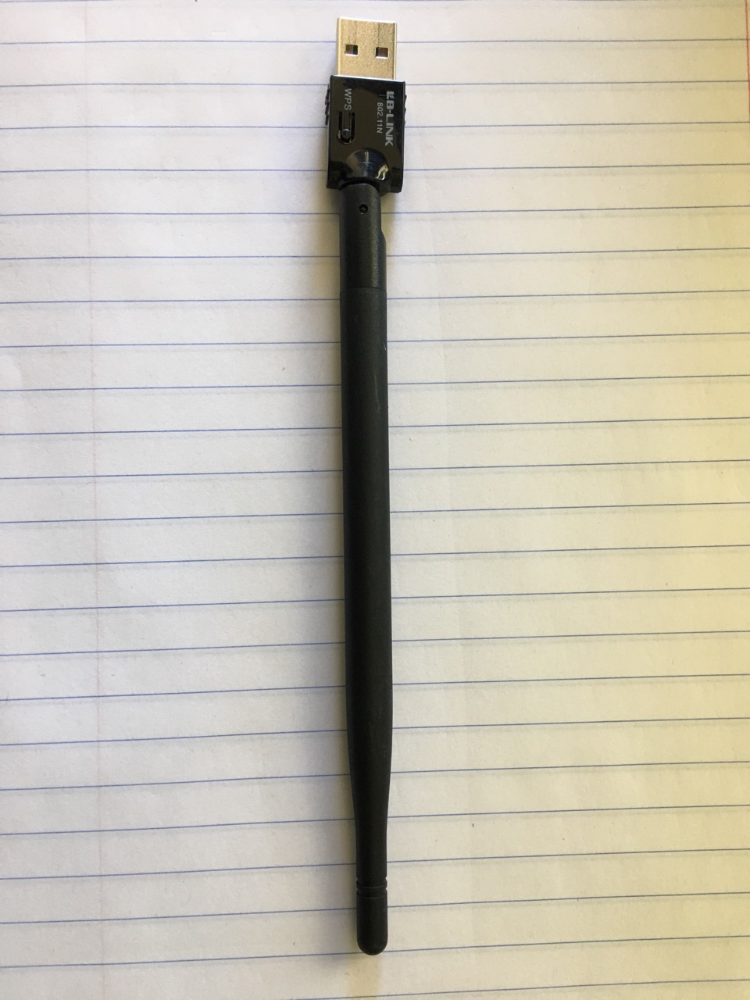
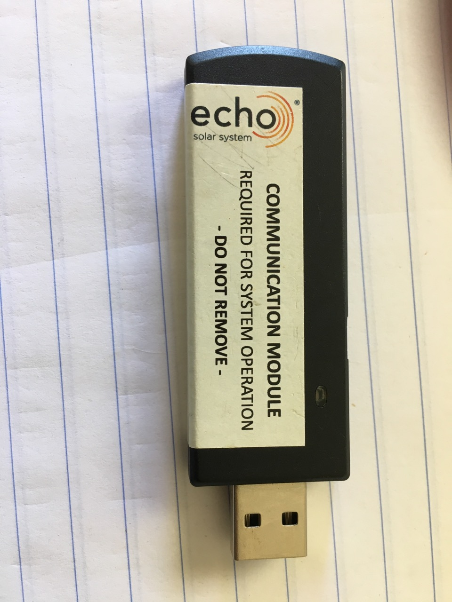
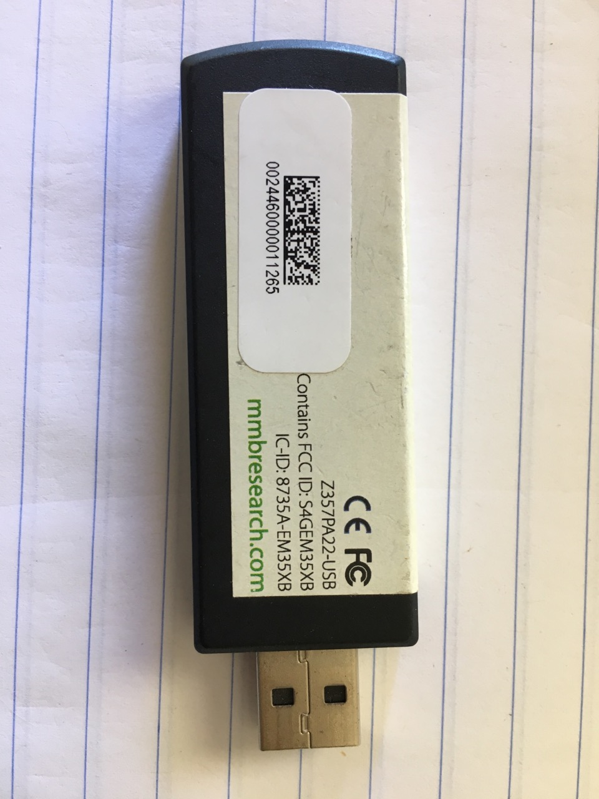
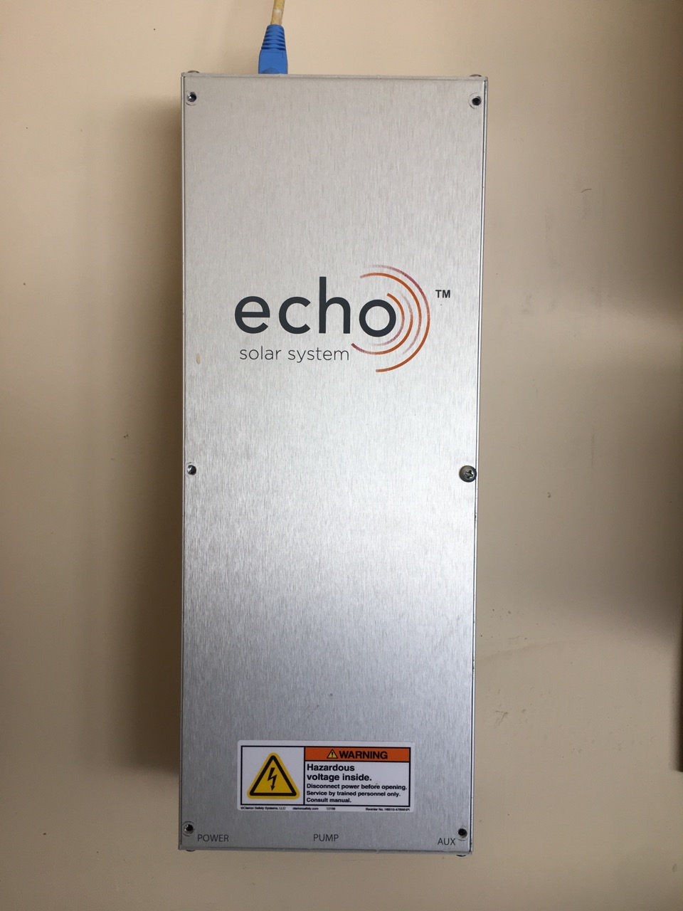
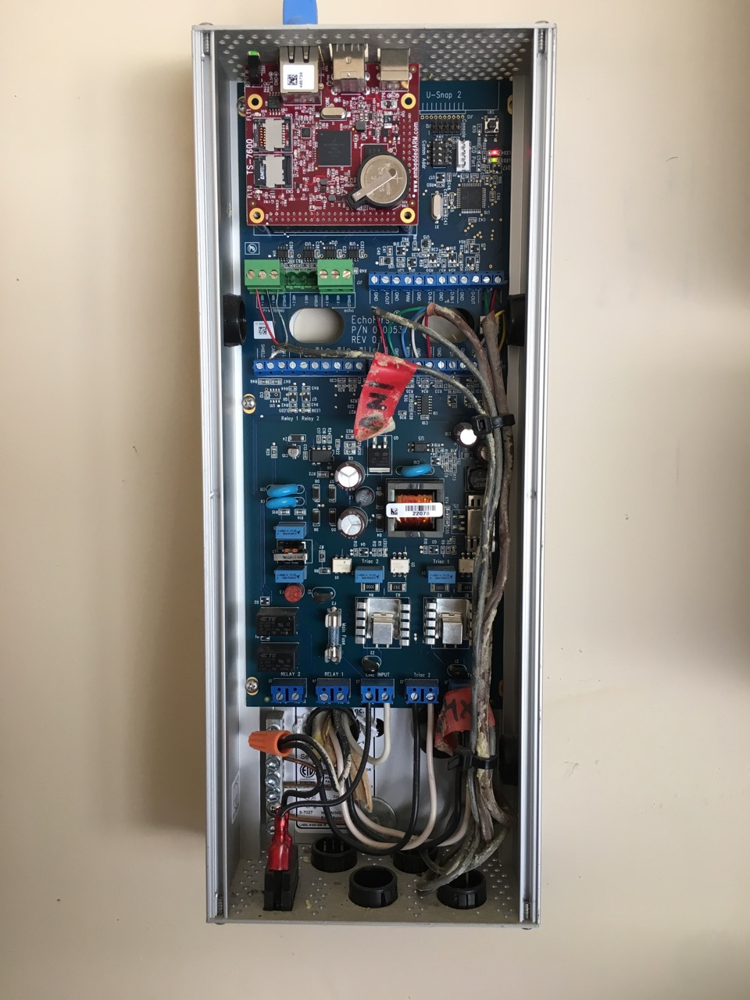
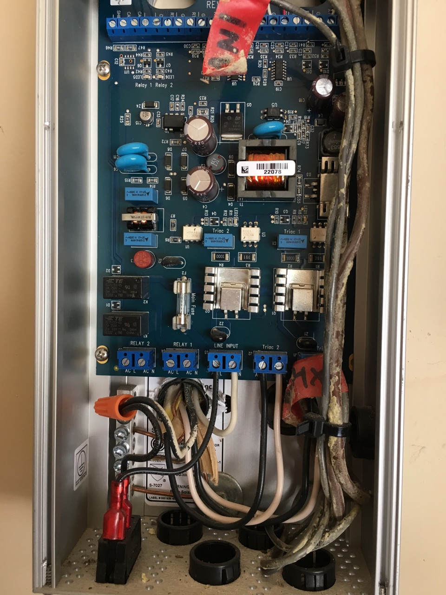
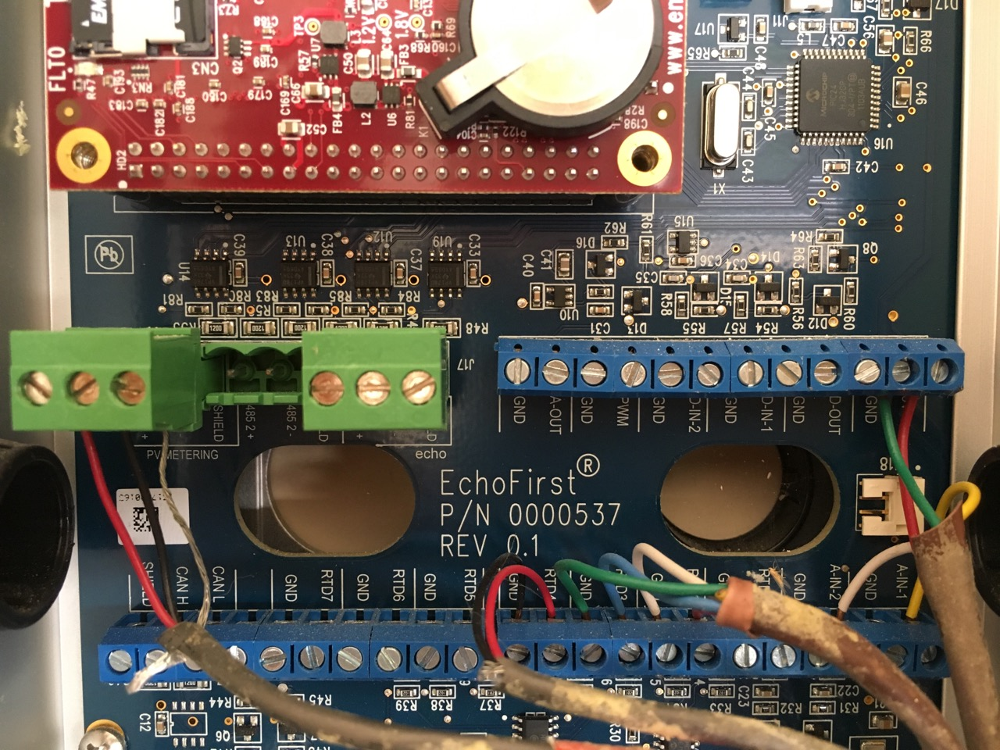
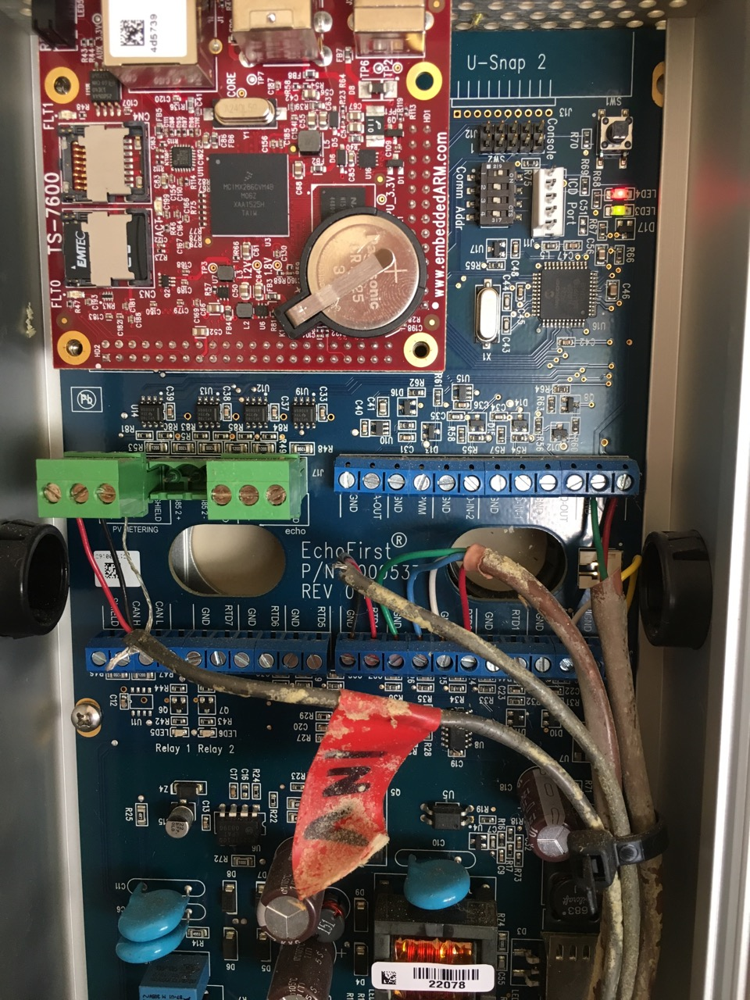
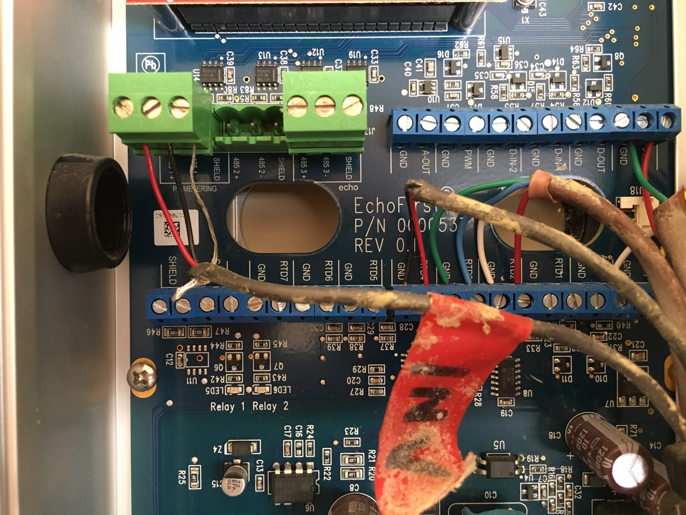

# EchoSolar


Replacement telemetry project for the now defunct Echo Solar System that was acquired by SunEdison

(abandoned) https://www.facebook.com/EchoSolarSystem

(abandoned) http://www.echofirst.com/

# Dashboard

SunEdison Monitoring Portal

(abandoned) https://echo.flexconnected.com/

Planning a new open source dashboard implemented in a popular language like Python or NodeJS.

TODO: need consensus here on the best existing project to use

Build a monitoring dashboard with resin.io

https://resin.io/blog/building-a-monitoring-dashboard-with-resin-io/

Create an Environmental Monitoring Dashboard

https://blog.alexellis.io/environmental-monitoring-dashboard/

Dashboard With Dashing.io

https://www.makeuseof.com/tag/raspberry-pi-dashboard/
# reddit

Help with Echo Solar Residential System

https://www.reddit.com/r/SolarDIY/comments/7nszl0/help_with_echo_solar_residential_system/

# Hardware

### TS-7500 (obsolete)

Obsolete embedded computer module that was originally installed in the EchoSolar garage panel.

https://www.embeddedarm.com/products/TS-7500

### TS-7600 (direct replacement / upgrade)

A direct replacement with Linux source code available.  This is the current module I have running since my TS-7500 was DOA.

https://www.embeddedarm.com/products/TS-7600

#### Linux

Kernel 2.6.35

Kernel 3.14 (I have this version built and running including WiFi driver)

https://wiki.embeddedarm.com/wiki/TS-7600#Compile_the_Kernel


# Connecting to the telemetry module (TS-7500 or TS-7600)

Serial FTDI Serial TTL-232 USB Cable

https://www.adafruit.com/product/70

```
[3378773.905809] usb 1-1.5: new full-speed USB device number 6 using ehci-pci
[3378774.005141] usb 1-1.5: New USB device found, idVendor=0403, idProduct=6001
[3378774.005144] usb 1-1.5: New USB device strings: Mfr=1, Product=2, SerialNumber=3
[3378774.005145] usb 1-1.5: Product: FT232R USB UART
[3378774.005146] usb 1-1.5: Manufacturer: FTDI
[3378774.005147] usb 1-1.5: SerialNumber: AI04YPM1
[3378774.016634] usbcore: registered new interface driver ftdi_sio
[3378774.016644] usbserial: USB Serial support registered for FTDI USB Serial Device
[3378774.016676] ftdi_sio 1-1.5:1.0: FTDI USB Serial Device converter detected
[3378774.016692] usb 1-1.5: Detected FT232RL
[3378774.017028] usb 1-1.5: FTDI USB Serial Device converter now attached to ttyUSB0
```

- Power off solar monitoring module with the switch on the bottom
- Remove phillips head screws from EchoSolar panel
- Remove the Ethernet and Zigbee 15.4 USB radio module
- Remove 4 phillips head screws from the embedded computer module
- Pull on the bottom two sides of the embedded computer module wiggling back and forth to unseat the 44 pin header from the circuit board
- Connect a USB A-Type to USB B-type cable from your computer to the embedded computer module to supply power
- Connect the orange (TX) of the serial cable to pin 8 CONSOLE_RXD on the embedded computer module and the yellow (RX) to pi 7 CONSOLE_TXD
- Start your serial console program to connect to the Linux command prompt (Linux Minicom or Screen, Windows TeraTerm Pro or Putty, MacOS CoolTerm or MacTERM)

115200 baud rate
8 data bits
No parity
1 stop bits
No flow control

Linux example:

sudo minicom -D /dev/tty.USB0 -b 115200

# Additional Features

- Mobile app to configure via BLE

# Additional Connectivity

- Add a LoRA module
- Configure Bluetooth to allow WiFi provisioning
- Add USB WiFi
- Add [GPS module](https://store.uputronics.com/index.php?route=product/product&product_id=84) or USB type



- 802.15.4 Zigbee USB module [mmbresearch.com](http://mmbnetworks.com)

```
[3378690.298608] usb 1-1.5: new full-speed USB device number 5 using ehci-pci
[3378690.392826] usb 1-1.5: New USB device found, idVendor=10c4, idProduct=8293
[3378690.392829] usb 1-1.5: New USB device strings: Mfr=1, Product=2, SerialNumber=3
[3378690.392830] usb 1-1.5: Product: Telegesis USB Device
[3378690.392831] usb 1-1.5: Manufacturer: Silicon Labs
[3378690.392832] usb 1-1.5: SerialNumber: 03012C5F
[3378690.401123] usbcore: registered new interface driver cp210x
[3378690.401133] usbserial: USB Serial support registered for cp210x
[3378690.401146] cp210x 1-1.5:1.0: cp210x converter detected
[3378690.401188] usb 1-1.5: cp210x converter now attached to ttyUSB0
```

 

# Installed Hardware Pictures



<p>


<p>


<p>


<p>


<p>


<p>



<p>


<p>



<p>


<p>



<p>


<p>



<p>


<p>



<p>


